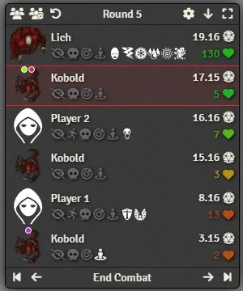
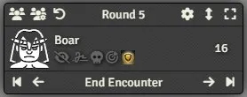
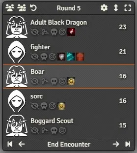
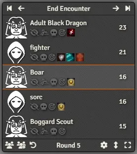
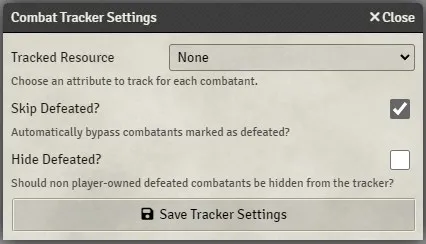

# FoundryVTT Mini Tracker

This module adds an extra floating `Combat Tracker` which provides new functionalities.

# Displayed when needed

The tracker will automatically appear on screen when there is an active encounter containing a combatant owned by the user (any combatant will do for the GM).

The tracker will be removed when those conditions are not met anymore.

# Minimized

The tracker is by default minimized to only display the current combatant, this allow for a very discreet tracker that can be placed in a corner of the screen.

While minimized, the user can mouse over the combatant to expand the tracker temporarily, the delay before expansion can be set (default 250ms).

# Expanded

The tracker can be expanded to a regular size either by hovering over the tracker or by clicking 

In that state, the tracker will reproduce the behavior of the normal combat tracker with the same features and color coding.

While expanded, you can reduce its size by dragging the extremity of the tracker (opposite to the header).

# Change Orientation

The user can change the expanded orientation of the tracker by clicking 

This will reverse the tracker's window and make it expand upward instead of downward, this is useful if the user wants the tracker to be anchored at the bottom of the screen.

# Saved

Position, orientation, minimized/expanded and size limite of the tracker are all saved on the user's browser between sessions.

# Change initiative by dragging combatant

The tracker allow the GM to reorganize and change the initiative of a combatant simply by dragging them inside the tracker: Click and hold the left-click for a short time and start dragging a combatant to another position.

This will set a new initiative for the combatant, using decimals when needed (which may or may not be shown in the tracker depending on the system).

# Move to combatant initiative

You can `ctrl + click` on a combatant to go directly to its initiative without having to click multiple time on `Next Turn` or `Previous Turn`

# Prevent Movement

If enabled, this module can prevent players from being able to move tokens on the board.

Combatant tokens will by default be prevented from moving when out of turn. A new  icon is added to allow the GM to "free" a combatant token until the end of the current turn.

## Monk's TokenBar

The module `Monk's TokenBar` already provides a better version of this feature, therefore, if present, its feature will be used instead and the  will toggle its state.

# Hide creatures name

If a recognized module/system allowing hidding creatures names is found, the name of the creatures will be hidden from the players when appropriate.

It will also add a new  icon to show the GM the current state, also allowing its toggle if possible.

If `shift` is held while toggling a combatant name, all the combatants with the same original actor will have their name toggled instead. This only applies to the combatants of the current combat.

## Systems

-   [Pathfinder Second Edition (Official)](https://foundryvtt.com/packages/pf2e)

## Modules

-   [Anonymous](https://foundryvtt.com/packages/anonymous)

# Settings

## Enabled (client)

Enable or disable the mini tracker for the user.

## Font Size (client)

Changing the font size will scale the whole tracker with it.

## Expand on Hover (client)

When enabled, the tracker will expand when hovering over the combatant.

## Hover Delay (client)

Set the amount of time (in milliseconds) before the tracker starts expanding on mouse hover.

## Only When Started

The tracker will only show up for players if the combat has actually started.

## End Turn

Should the players be able to end their own turn.

## Show HP

Select the requirement to display HP in the tracker.

-   `Do not show` will never show the HP
-   `GM only` will only show the HP on the GM client
-   `Allies only` will show HP of player-owned combatants to the players, GM will see all the HP.
-   `Everybody` will show HP of all the combatants to players and GM alike.

## HP Value Path

If set with an actor system path, will display the current hp of combatants in the tracker.

NOTE: the systems `DnD5e` and `PF2e` have their own functionality for it

## HP Max Path

If set with an actor system path, will color code the hp on the tracker depending on the ratio current/max HP. This requires a valid path for HP value too.

NOTE: the systems `DnD5e` and `PF2e` have their own functionality for it

## Dim Anonymous

When enabled, names will be dimmed out to put an accent on the fact that it is hidden from players.

## Hide Defeated?

Should non player-owned defeated combatants be hidden from the tracker?

The setting is also present in the `Combat Tracker Settings` window.

## Hide Combatants

Should non player-owned combatants be hidden when added to the combat. This is not linked to the token hidden state.

## Reveal Combatants

Should hidden combatants be revealed when their turn comes.

## Reveal Tokens

Should combatants tokens also be revealed when their turn comes. `Reveal Combatants` must be enabled.

## Prevent Movement

When enabled, players will only be able to move their token during their turn. Or when the GM allows it. This setting will not do anything if the module Monk's TokenBar is present to avoid conflict.

## Pan to Token

Should the camera pan to the token of the current combatant. This option is only for the GM.

## Select Token

Should the token of the current combatant be automatically selected. This option is only for the GM.

## Open Sheet

Should the sheet of the current combatant be automatically opened. This option is only for the GM.

# Secret

A hidden setting has been added to allow the tracker to be expanded upward without changing its UI, this setting will not appear anywhere accessible because it messes up with a few of the core feature of the tracker (because the header is not opposite to the part that is supposed to shrink anymore).

To change this setting, simply open your browser devtools (F12) and in the console type:

    game.settings.set('mini-tracker', 'fake-reversed', true)

To return to the normal behavior simply type:

    game.settings.set('mini-tracker', 'fake-reversed', false)

# CHANGELOG

You can see the changelog [HERE](./CHANGELOG.md)
