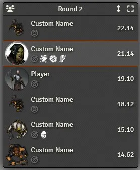
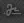

# FoundryVTT Mini Tracker

This module adds an extra floating `Combat Tracker` which provides new functionalities.

## Displayed when needed

The tracker will automatically appear on screen when there is an active encounter containing a combatant owned by the user (any combatant will do for the GM).

The tracker will be removed when those conditions are not met anymore.

## Minimized

The tracker is by default minimized to only display the current combatant and the header (also footer for the GM), this allow for a very discreet tracker that can be placed in a corner of the screen.

While minimized, the user can mouse over the combatant to expand the tracker temporarily, the delay before expansion can be set (default 250ms).

## Expanded

The tracker can be expanded to a regular size either by hovering over the tracker or by clicking 

In that state, the tracker will reproduce the behavior of the normal combat tracker with the same features and color coding.

While expanded, you can reduce its size by dragging the extremity of the tracker (opposite to the header).

## Change Orientation

The user can change the expanded orientation of the tracker by clicking 

This will reverse the entire tracker, placing the header at the bottom (footer at the top for the GM) and expand the tracker upward instead of downward, this is useful if the user wants the tracker to be anchored at the bottom of the screen.

## Saved

Position, orientation, minimized/expanded and size limite of the tracker are all saved on the user's browser between sessions.

## Hide creatures name

The GM can set up a name that will be used in stead of NPC names in the tracker for the players. NOTE: it will also change the name in the regular tracker, otherwise this feature would be pointless.

The GM can toggle showing individual NPC names by clicking 

The `Pathfinder Second Edition` system already has a system-wide feature to hide creature names, in that case, the module will directly hook into the system's feature, otherwise, the module will use its own mechanic.

## Change initiative by dragging combatant

The tracker allow the GM to reorganize and change the initiative of a combatant simply by dragging them inside the tracker: Click and hold the left-click for a short time and start dragging a combatant to another position.

This will set a new initiative for the combatant, using decimals when needed (which may or may not be shown in the tracker depending on the system).

## Pan, Select and Open Sheet

Those options are available to the GM to help them navigate quicker to the creature which turn it is:

-   If `Pan to Token` is enabled (default), the screen will center to the creature.

-   If `Select Token` is enabled (default), the creature will automatically be selected.

-   If `Open Sheet` is enabled, the creature's sheet will automatically be opened.

Those options are only active for the GM when enabled, not for the players.
